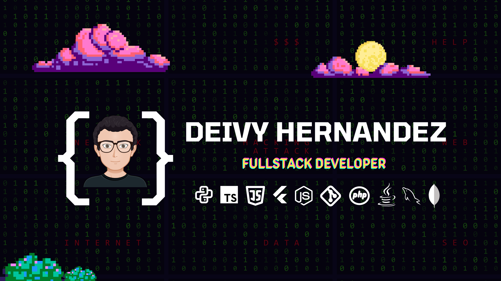

<h1 align="center">Hola, Soy Deivy Hernandez</h1>

### 👨🏻‍💻 &nbsp;About Me

🚀 &nbsp; Apasionado por la tecnología \
🎓 &nbsp; Ingeniero en informática \
🎸 &nbsp; En mis momentos libres toco la guitarra. \
🎮 &nbsp; Me gustan los videojuegos, más si se trata de la F1. \
🐶 &nbsp; PetLover forever. \
💬 &nbsp; Me encanta charlar sobre todo tipo de temas, puedes encontrarme en deivyhernandezperez@gmail.com

### 🛠 &nbsp;Tech Stack

  
  
  
  
  
  
  
  
  
  
  
  
  
  
  
  
  
  
  
  
  
  
  
  
  
  
  
  
  
  
  
  
  
  
  

### ⚙️ &nbsp;GitHub Analytics

###

<a href="https://github.com/deivyrene">
  
  <! --- 
</a>

###

### 🤝🏻 &nbsp; Encuentrame:

